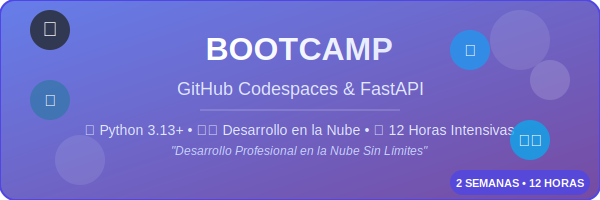

# 🚀 Bootcamp GitHub Codespaces & FastAPI

<!-- ¿QUÉ? Banner principal del bootcamp -->
<!-- ¿POR QUÉ? Identidad visual clara y profesional -->
<!-- ¿PARA QUÉ? Atraer y contextualizar el contenido del bootcamp -->




[](https://codespaces.new/tu-usuario/bc-codespaces?quickstart=1)
[](https://github.com/codespaces)
[](https://fastapi.tiangolo.com/)
[](https://www.python.org/)
[](https://alpinelinux.org/)
[](https://opensource.org/licenses/MIT)

## ⏱️ Duración del Bootcamp

Bootcamp Intensivo de 12 horas distribuidas en 2 jornadas de 6 horas durante 2 semanas

</div>

---

## 🎯 **¿Qué es este Bootcamp?**

Un programa intensivo para aprender **desarrollo de APIs REST modernas** usando **GitHub Codespaces** como entorno de desarrollo en la nube, eliminando la necesidad de instalaciones locales.

### **¿Por qué GitHub Codespaces?**

- 🚫 **Sin instalaciones locales** - Las máquinas Windows 11 no pueden configurar Docker
- ☁️ **Desarrollo en la nube** - Entorno consistente para todos los participantes
- ⚡ **Setup instantáneo** - Desde navegador web en segundos
- 🔄 **Colaboración real** - Compartir y revisar código en tiempo real

---

## 📅 **Estructura del Programa**

### **Día 1 (6 horas) - Fundamentos y Setup**

```text
09:00-10:30 │ Configuración de GitHub Codespaces
10:45-12:00 │ Fundamentos de FastAPI
13:00-14:30 │ Estructura de proyecto y mejores prácticas
14:45-16:00 │ API básica con SQLite + Testing
```

### **Día 2 (6 horas) - Avanzado y Producción**

```text
09:00-10:30 │ Middleware y seguridad
10:45-12:00 │ Autenticación y autorización JWT
13:00-14:30 │ GitHub Codespaces avanzado + Docker en la nube
14:45-16:00 │ CI/CD con GitHub Actions + Deployment
```

---

## 🛠️ **Stack Tecnológico**

| Tecnología            | Versión    | Propósito                |
| --------------------- | ---------- | ------------------------ |
| **🐍 Python**         | 3.13+      | Runtime principal        |
| **⚡ FastAPI**        | ^0.104.1   | Framework web moderno    |
| **🗄️ SQLite**         | Integrada  | Base de datos sin config |
| **🔄 SQLAlchemy**     | 2.0+       | ORM con soporte async    |
| **🧪 pytest**         | ^7.4.3     | Testing profesional      |
| **📚 OpenAPI**        | Auto       | Documentación automática |
| **🐳 Docker**         | En la nube | Containerización         |
| **🔧 GitHub Actions** | Integrada  | CI/CD pipeline           |

</div>

---

## 🚀 **Inicio Rápido**

### **1. Abrir en GitHub Codespaces**

```bash
# Opción A: Desde GitHub
Ir a: Repositorio → Code → Codespaces → Create codespace

# Opción B: Desde URL directa
https://github.com/codespaces/new?hide_repo_select=true&ref=main&repo=TU_REPO
```

### **2. Activar entorno virtual**

```bash
# Se configura automáticamente, pero si necesitas:
source venv/bin/activate

# O usar el alias configurado:
activate
```

### **3. Iniciar desarrollo**

```bash
# Servidor de desarrollo con recarga automática
dev

# O manualmente:
uvicorn main:app --reload --host 0.0.0.0 --port 8000
```

### **4. Acceder a la API**

- **Aplicación**: `http://localhost:8000`
- **Documentación interactiva**: `http://localhost:8000/docs`
- **Esquema OpenAPI**: `http://localhost:8000/redoc`

---

## 📁 **Estructura del Proyecto**

```text
📦 bc-codespaces/
├── 📁 _docs/                    # 📚 Documentación técnica
│   ├── setup/                   # 🔧 Configuración inicial
│   ├── api/                     # 📋 Documentación de la API
│   ├── best-practices/          # ✨ Mejores prácticas
│   └── troubleshooting/         # 🛠️ Solución de problemas
├── 📁 bootcamp/
│   └── semana-01/               # 🎓 Primera semana del bootcamp
│       ├── 1-teoria/            # 📖 Contenido teórico
│       ├── 2-ejercicios/        # 💪 Ejercicios prácticos
│       ├── 3-proyecto/          # 🏗️ Proyecto principal
│       └── 4-recursos/          # 📚 Recursos adicionales
│           ├── ebooks.md        # 📖 Enlaces a libros
│           ├── videografia.md   # 🎥 Enlaces a videos
│           └── webgrafia.md     # 🌐 Enlaces web
├── 📁 scripts/                  # 🤖 Scripts de automatización
│   ├── setup-python-env.sh     # 🐍 Configuración Python
│   ├── auto-commit.sh           # ⏰ Commits automáticos
│   ├── setup-auto-commit.sh    # ⚙️ Configurar auto-commits
│   └── stop-auto-commit.sh      # 🛑 Detener auto-commits
├── 📁 src/                      # 💻 Código fuente de la API
├── 📁 tests/                    # 🧪 Tests automatizados
├── 📁 logs/                     # 📝 Archivos de log
├── 🐳 .devcontainer/           # ⚙️ Configuración de Codespaces
├── ⚙️ .github/                 # 🔧 GitHub Actions y configuración
└── 📋 requirements.txt         # 📦 Dependencias Python
```

---

## ⚡ **Optimización para Free Tier**

GitHub Codespaces **Free Tier** incluye **120 horas/mes**. Hemos optimizado todo para maximizar tu tiempo:

### **🏔️ Alpine Linux Ultra-Ligero**

```yaml
# 62% menos recursos que Debian/Ubuntu
'image': 'python:3.13-alpine' # ~45MB vs ~120MB
```

### **📝 Una Pestaña Activa**

```json
"workbench.editor.limit.enabled": true,
"workbench.editor.limit.value": 1
```

### **⏰ Commits Automáticos (Cada 5 min)**

```bash
# Preservar trabajo constantemente
./scripts/setup-auto-commit.sh
```

### **🔧 Scripts de Gestión**

```bash
# Configuración optimizada automática
./scripts/setup-python-env.sh

# Monitorear uso de recursos
htop  # Preinstalado en el entorno
```

---

## 🧪 **Comandos de Desarrollo**

### **Desarrollo diario**

```bash
activate      # Activar entorno virtual
dev          # Iniciar servidor FastAPI
test         # Ejecutar tests con pytest
format       # Formatear código (black + isort)
lint         # Verificar código con ruff
```

### **Base de datos**

```bash
# Migraciones con Alembic
alembic revision --autogenerate -m "descripción"
alembic upgrade head

# SQLite directo
sqlite3 app.db ".tables"
```

### **Testing completo**

```bash
pytest -v                    # Tests detallados
pytest --cov=src            # Con cobertura
pytest -k "test_auth"       # Tests específicos
```

---

## 📚 **Recursos de Aprendizaje**

### **Documentación Oficial**

- 📖 [FastAPI Docs](https://fastapi.tiangolo.com/)
- 🐳 [GitHub Codespaces](https://docs.github.com/en/codespaces)
- 🐍 [Python 3.13](https://docs.python.org/3.13/)

### **En este repositorio**

- 📁 `bootcamp/semana-01/4-recursos/ebooks.md` - Libros recomendados
- 🎥 `bootcamp/semana-01/4-recursos/videografia.md` - Videos tutoriales
- 🌐 `bootcamp/semana-01/4-recursos/webgrafia.md` - Recursos web

---

## 🎯 **Objetivos de Aprendizaje**

Al finalizar este bootcamp, habrás creado una **API REST completa y production-ready** con:

### **✅ Funcionalidades Técnicas**

- [x] **Autenticación JWT** - Sistema de login seguro
- [x] **CRUD completo** - Create, Read, Update, Delete
- [x] **Validaciones Pydantic** - Entrada y salida de datos
- [x] **Tests automatizados** - Unitarios e integración
- [x] **Documentación automática** - OpenAPI/Swagger
- [x] **Base de datos async** - SQLAlchemy + SQLite
- [x] **Migraciones** - Control de versiones de BD

### **🚀 Habilidades Profesionales**

- [x] **Desarrollo en la nube** - GitHub Codespaces
- [x] **Containerización** - Docker sin instalación local
- [x] **CI/CD Pipeline** - GitHub Actions
- [x] **Conventional Commits** - Commits profesionales
- [x] **Code Quality** - Linting, formatting, testing
- [x] **Colaboración** - Git workflow profesional

---

## 🛠️ **Troubleshooting**

### **Problemas comunes**

#### **🐍 Entorno virtual no activo**

```bash
# Solución:
source venv/bin/activate
# o
./activate_venv.sh
```

#### **📦 Dependencias faltantes**

```bash
# Solución:
./scripts/setup-python-env.sh
```

#### **🔌 Puerto 8000 ocupado**

```bash
# Solución: Usar otro puerto
uvicorn main:app --reload --host 0.0.0.0 --port 8080
```

#### **💾 Commits automáticos no funcionan**

```bash
# Verificar crontab
crontab -l

# Revisar logs
tail -f logs/auto-commit.log

# Reconfigurar
./scripts/setup-auto-commit.sh
```

#### **🖥️ VS Code mostrando múltiples pestañas**

```bash
# Solución 1: Aplicar configuraciones automáticamente
./scripts/setup-vscode-local.sh

# Solución 2: Forzar configuración (si persiste el problema)
./scripts/fix-vscode-tabs.sh
```

**¿Por qué pasa esto?**

- VS Code local no aplica automáticamente la configuración del devcontainer
- Las configuraciones de workspace pueden no cargarse correctamente

**Configuraciones aplicadas:**

- `workbench.editor.limit.enabled: true` - Limita pestañas activas
- `workbench.editor.limit.value: 1` - Solo 1 pestaña visible
- `workbench.editor.showTabs: "single"` - Mostrar tabs en modo single

### **🆘 Obtener ayuda**

- 📚 Revisar `_docs/troubleshooting/`
- 📝 Crear issue en el repositorio
- 💬 Preguntar en las sesiones del bootcamp

---

## 🤝 **Contribuir**

### **Conventional Commits**

```bash
# Formato requerido:
<type>(<scope>): <description>

Why: <razón del cambio>
What: <qué se cambió específicamente>
Impact: <impacto en el sistema>

# Ejemplo:
feat(auth): implement JWT authentication system

Why: Users need secure access to protected endpoints
What: Added JWT token generation, validation middleware, and protected routes
Impact: Enables user authentication and authorization across the API
```

### **Tipos de commits**

- `feat`: Nueva funcionalidad
- `fix`: Corrección de bug
- `docs`: Cambios en documentación
- `style`: Formato, espacios, etc.
- `refactor`: Cambios de código sin afectar funcionalidad
- `test`: Agregar o modificar tests
- `chore`: Mantenimiento general

---

## 📈 **Métricas del Proyecto**

| Métrica                | Valor               | Objetivo           |
| ---------------------- | ------------------- | ------------------ |
| **Tiempo de Setup**    | < 2 minutos         | ⚡ Inicio rápido   |
| **Cobertura de Tests** | > 80%               | 🎯 Calidad alta    |
| **Tiempo de Build**    | < 30 segundos       | 🚀 CI/CD eficiente |
| **Uso de Free Tier**   | Optimizado 120h/mes | 💰 Costo cero      |
| **Performance API**    | < 100ms respuesta   | ⚡ Velocidad alta  |

---

## 👥 **Equipo**

### **Instructor Principal**

- 👨‍💻 **[Tu Nombre]** - Senior Full-Stack Developer
- 📧 Email: <tu-email@ejemplo.com>
- 🐙 GitHub: [@tu-github](https://github.com/tu-github)

### **Asistentes**

- 👩‍💻 **[Asistente 1]** - Python Specialist
- 👨‍💻 **[Asistente 2]** - DevOps Engineer

---

## 📜 **Licencia**

Este proyecto está licenciado bajo la **MIT License** - ver el archivo [LICENSE](LICENSE) para detalles.

---

## 🙏 **Agradecimientos**

- 🚀 **GitHub** por proporcionar Codespaces
- ⚡ **FastAPI** por el framework increíble
- 🐍 **Python Software Foundation** por Python
- 🏔️ **Alpine Linux** por la imagen ultra-ligera
- 👥 **Comunidad Open Source** por las herramientas

---

## 🚀 **Comienza Ahora**

### 🎓 Bootcamp GitHub Codespaces & FastAPI

_Desarrollo profesional en la nube sin límites_

[](https://github.com/codespaces/new?hide_repo_select=true&ref=main&repo=TU_REPO)

---

⭐ **¡Si este bootcamp te ayudó, considera darle una estrella!** ⭐
