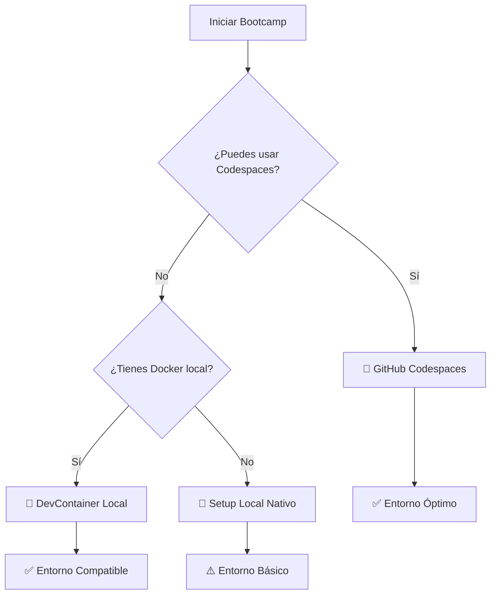

# 🐳 Estrategia de DevContainers en el Bootcamp

## 🎯 **Prioridad de Entornos**

### **1. 🥇 GitHub Codespaces (Principal) - 90% del tiempo**

**¿CUÁNDO?**

- Durante todas las sesiones del bootcamp
- Para ejercicios y proyecto principal
- Para colaboración en tiempo real

**¿POR QUÉ?**

- ✅ Entorno 100% consistente para todos
- ✅ Sin problemas de configuración local
- ✅ Docker integrado sin instalación
- ✅ Máquinas Windows 11 sin limitaciones

**¿CÓMO?**

```bash
# Automático al abrir Codespace
.devcontainer/devcontainer.json → Python 3.13 + Alpine + Docker
```

### **2. 🥈 VS Code Local + DevContainer (Opcional) - 8% del tiempo**

**¿CUÁNDO?**

- Si el participante tiene Docker local
- Para trabajar offline ocasionalmente
- Para aprender sobre contenedores locales

**¿POR QUÉ?**

- ✅ Mismo entorno que Codespaces
- ✅ Trabajar sin conexión
- ⚠️ Requiere Docker Desktop instalado

**¿CÓMO?**

```bash
# En VS Code local
Cmd+Shift+P → "Dev Containers: Reopen in Container"
```

### **3. 🥉 Local Nativo (Fallback) - 2% del tiempo**

**¿CUÁNDO?**

- Solo si fallan las otras opciones
- Para debugging de configuración local
- Máquinas con restricciones extremas

**¿POR QUÉ?**

- ⚠️ Posibles inconsistencias entre máquinas
- ⚠️ Requiere instalación manual de dependencias
- ✅ Funciona sin Docker

**¿CÓMO?**

```bash
./scripts/setup-python-local.sh  # Crea venv local
```

## 🔄 **Flujo de Decisión**



## 📊 **Comparación de Entornos**

| Aspecto          | Codespaces    | DevContainer Local  | Local Nativo        |
| ---------------- | ------------- | ------------------- | ------------------- |
| **Consistencia** | 🟢 100%       | 🟢 95%              | 🟡 70%              |
| **Setup Time**   | 🟢 2 min      | 🟡 5 min            | 🔴 15 min           |
| **Docker**       | 🟢 Integrado  | 🟢 Local            | 🔴 No disponible    |
| **Recursos**     | 🟢 Escalables | 🟡 Limitados por HW | 🟡 Limitados por HW |
| **Colaboración** | 🟢 Real-time  | 🟡 Git only         | 🟡 Git only         |
| **Offline**      | 🔴 No         | 🟢 Sí               | 🟢 Sí               |

## 🎓 **Durante el Bootcamp**

### **Día 1: Setup y Configuración**

- ✅ **Todos** empiezan con GitHub Codespaces
- ✅ Configuración automática con devcontainer.json
- ✅ Verificación de entorno consistente

### **Día 2: Desarrollo Avanzado**

- ✅ Docker-in-Docker para containerización
- ✅ CI/CD con Actions (integración nativa)
- ✅ Deployment desde Codespaces

### **Post-Bootcamp: Continuidad**

- 🎯 Participantes pueden elegir su entorno preferido
- 📚 Documentación para todos los escenarios
- 🔄 DevContainer facilita transición entre entornos
